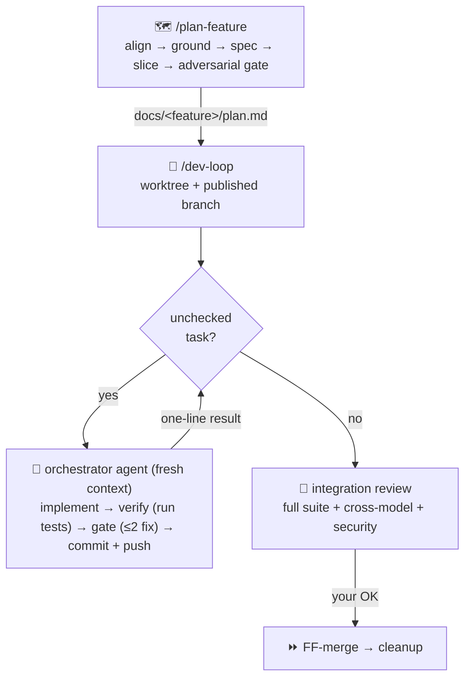

# claude-config

Claude Code workflow for long-running feature work — clone-able across machines.

> A **resume-notes loop**: work lives task-by-task in an isolated worktree with a `progress.md`
> cursor, and every change passes a locked cross-model review gate.
> *One mind holds the seams.*

## The loop



| Command | One job |
|---|---|
| `/plan-feature` | rough idea → grounded plan: every symbol pinned to a real `file:line`, seams/twins mapped, vertical slices — then **codex adversarially audits the plan** before anything is built |
| `/dev-loop` | executes the plan; a fresh orchestrator agent per task keeps the main thread lean; survives `/clear` |
| `/review-task` | the locked gate: tests must run green first, then Claude + codex judge the same diff by the same rubric; `--integration` adds the security specialist; `--re-review` re-gates just the fix |

**The invariant** (why `/clear` is always safe) — at every task boundary:
`branch commits = approved tasks` · `working tree = task in flight` · `progress.md = cursor`

## What's here

| Path | Role |
|---|---|
| `commands/` | the three commands above |
| `agents/dev-loop-orchestrator.md` | per-task agent: one task to done, then return |
| `rubrics/per-task-review.md` | shared rubric — correctness · seams/twins · plan-conformance · test *quality* |
| `reference/` | seam-design · leanness (YAGNI) · security review axes |
| `templates/` | `plan.md` checklist + `progress.md` cursor |
| `skills/flow-report/` | export any plan/flow/diff as a self-contained HTML diagram report |
| `codex/` + `bootstrap-codex.sh` | the planner, ported to Codex's skill model |
| `archive/` | superseded drivers (manual, JS-Workflow, v2 DAG) — restorable |

## Setup

```bash
git clone <this-repo> ~/projects/claude-config
~/projects/claude-config/bootstrap.sh        # per-file symlinks into ~/.claude
~/projects/claude-config/bootstrap-codex.sh  # optional: planner for Codex
```

## Credits

Vendored + adapted, kept self-contained and rewired to the `plan.md`/`progress.md` loop:

- [mattpocock/skills](https://github.com/mattpocock/skills) (MIT) — grilling, codebase-design, to-prd, to-issues, review
- [DietrichGebert/ponytail](https://github.com/DietrichGebert/ponytail) (MIT) — lean implement mode + leanness review axis
- [vercel-labs/deepsec](https://github.com/vercel-labs/deepsec) (Apache-2.0) — security knowledge distilled into `reference/security-review.md` (no scanner vendored)
